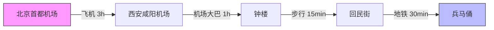
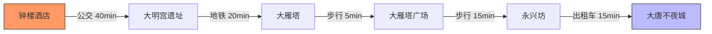

# 旅行手册模板
这是一个旅行手册的模板，基于我之前出行的经验，希望这个目标可以成为日常旅行的一个查阅手册标准。
模板会尽可能兼顾不同的旅行方式、旅行时长。通过结合一些有趣模块，方便的展示。

# 行程概览模块
引入了Mermaid的流程图，使用最清晰简洁的方式展示整个行程：
## 大交通信息
| 交通类型 | 航班/车次 | 出发地点 | 目的地 | 日期 | 时间 | 价格 | 备注 |
|---------|----------|---------|--------|------|------|------|------|
| ✈️ 飞机 | MU2153 | 北京首都T2 | 西安咸阳T3 | 5月1日 | 08:30-11:00 | ¥820 | 含托运行李 |
| 🚄 高铁 | G652 | 西安北站 | 北京西站 | 5月5日 | 15:30-20:10 | ¥515.5 | 二等座 |


## 第一天

::: details 点击查看行程流程图代码
```
flowchart LR
    A[北京首都机场] -->|飞机 3h| B[西安咸阳机场]
    B -->|机场大巴 1h| C[钟楼]
    C -->|步行 15min| D[回民街]
    D -->|地铁 30min| E[兵马俑]
    
    style A fill:#f9f,stroke:#333
    style E fill:#bbf,stroke:#333
```
::: 


```mermaid
gantt
    title 第一天行程安排
    dateFormat HH:mm
    axisFormat %H:%M
    
    section 上午
    机场到市区    :09:00, 10:00
    游览钟楼     :10:00, 11:30
    section 下午
    回民街午餐    :11:30, 13:00
    前往兵马俑    :13:00, 13:30
    参观兵马俑    :13:30, 16:30
```

::: details 点击查看行程甘特图代码
```
gantt
    title 第一天行程安排
    dateFormat HH:mm
    axisFormat %H:%M
    
    section 上午
    机场到市区    :09:00, 10:00
    游览钟楼     :10:00, 11:30
    section 下午
    回民街午餐    :11:30, 13:00
    前往兵马俑    :13:00, 13:30
    参观兵马俑    :13:30, 16:30
```
::: 


## 第二天

```mermaid
gantt
    title 第二天行程安排
    dateFormat HH:mm
    axisFormat %H:%M
    
    section 上午
    酒店早餐    :09:00, 09:30
    前往大明宫   :09:30, 10:10
    游览大明宫   :10:10, 12:00
    section 下午
    大雁塔午餐   :12:00, 13:30
    大雁塔广场   :13:30, 15:00
    永兴坊小吃   :15:00, 17:00
    section 晚上
    大唐不夜城   :19:00, 21:30
```




# 景点信息
这个模块会展示每个景点的详细信息，包括门票、开放时间、交通、周边美食等。

# 攻略资料
这个模块希望通过多媒体的方式展示攻略资料，包括图片、视频、音频等。

<div style="position: relative; padding: 30% 45%;">
  <iframe src="//player.bilibili.com/player.html?bvid=BV1Aw411M743&autoplay=0&danmaku=0&page=1" 
    scrolling="no" 
    border="1" 
    frameborder="no" 
    framespacing="0" 
    allowfullscreen="true" 
    sandbox="allow-top-navigation allow-same-origin allow-forms allow-scripts"
    style="position: absolute; width: 100%; height: 100%; left: 0; top: 0;">
  </iframe>
</div>

::: details 点击查看视频代码
```
<div style="position: relative; padding: 30% 45%;">
  <iframe src="//player.bilibili.com/player.html?bvid=这里改成bilibili的视频BV号&autoplay=0&danmaku=0&page=1" 
    scrolling="no" 
    border="1" 
    frameborder="no" 
    framespacing="0" 
    allowfullscreen="true" 
    sandbox="allow-top-navigation allow-same-origin allow-forms allow-scripts"
    style="position: absolute; width: 100%; height: 100%; left: 0; top: 0;">
  </iframe>
</div>
```
::: 

<div style="position: relative; padding-bottom: 56.25%; height: 0;">
  <iframe 
    src="https://www.youtube.com/embed/41x-IYB5aU4?autoplay=0&mute=0&controls=1&origin=https://your-domain.com&playsinline=1&rel=0" 
    style="position: absolute; top: 0; left: 0; width: 100%; height: 100%;" 
    frameborder="0" 
    allow="accelerometer; autoplay; clipboard-write; encrypted-media; gyroscope; picture-in-picture" 
    allowfullscreen>
  </iframe>
</div>

<!-- 这种方式小红书显示不稳定，需要登录 -->
<!-- <div style="position: relative; padding-bottom: 100%; height: 0;">
  <iframe 
    src="https://www.xiaohongshu.com/explore/67611a920000000013019dbb" 
    style="position: absolute; top: 0; left: 0; width: 100%; height: 100%;" 
    frameborder="0">
  </iframe>
</div> -->


# 物品清单
<!-- 行前准备清单 -->
## 证件类
<input type="checkbox" checked> 护照
<input type="checkbox"> 签证
<input type="checkbox"> 身份证
<input type="checkbox"> 驾照(如需)
<input type="checkbox"> 证件复印件/电子版

# 汇率计算
<!-- 使用 Exchange Rates Widget -->
<div style="width: 100%; max-width: 100%;">
<ExchangeRateCalculator />

</div>

## 现场实时摄像头

类似皇后镇现场实时摄像头，随时可以看看皇后镇的实时情况。刮风下雪，落日星空！而且可以查询任意历史时刻。它大概每10分钟更新一次全景照片。

<iframe 
  src="https://queenstown.roundshot.com/" 
  width="100%" 
  height="500px" 
  frameborder="0"
  scrolling="no"
  allowfullscreen="true"
  style="border: none;"
  title="皇后镇实时摄像头"
>
</iframe>